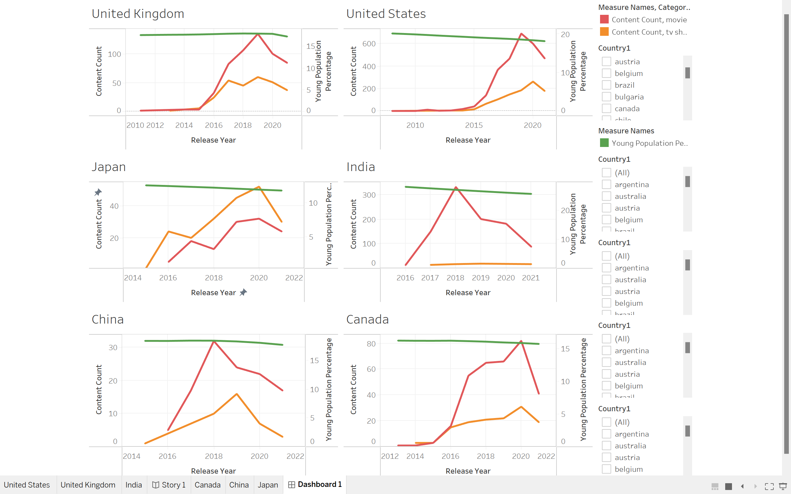

# Youthful Eyes on OTT: A Global Content Production Analysis

- In this project, our primary aim is to investigate the potential correlation between the proportion of young people in a country and the quantity of content generated on Over-The-Top (OTT) platforms. Over the top platforms are online platforms which provides content release services and provide contents to the consumer over the internet. It gets its name Over the top (OTT) as the contents are released over the top of the internet services. Here, We wanted to differentiate between longer formats, such as TV shows, and shorter formats like movies. Our study seeks to determine whether the presence of a youthful demographic in a country has a discernible impact on the overall volume of content produced on OTT platforms.
-  used Datacamp website ennvironment for executing the data modelling and Exported csv files after cleaning and merging different contents from various platforms and Analysed using Tableau

# Data Camp Notebook Link ( Attached the notebook exported as HTML embedded in the repo for quicker loading time ) - 

# Fuzzy Matching and Sentence Transformer
- Sentence Transformers are models that transform text into fixed-size numerical representations (embeddings) suitable for various natural language processing tasks, including similarity calculations.
- These embeddings capture the semantic meaning of the text, allowing for effective comparison between sentences.
- FuzzyWuzzy, on the other hand, is a library in Python that provides fuzzy string matching capabilities, allowing you to compare strings or sequences of text and determine their similarity based on various algorithms like Levenshtein distance, among others.
# Basic approach to using Sentence Transformers and FuzzyWuzzy together
- Generate embeddings for your sentences using a Sentence Transformer model to represent the semantic meaning of the text.
- Use the generated embeddings to compute the similarity between sentences. You can use cosine similarity or other distance metrics to compare the embeddings and quantify their similarity.
- If needed, you can use FuzzyWuzzy to perform additional string matching or similarity calculations based on different algorithms provided by the library. However, keep in mind that FuzzyWuzzy primarily operates on the textual level and doesn't leverage semantic embeddings like Sentence Transformers do.
- Combining these two approaches can provide a more comprehensive understanding of similarity by considering both the semantic meaning of text (captured by embeddings from Sentence Transformers) and the character-level or token-level similarities measured by FuzzyWuzzy.
- Providing embeddings generated by Sentence Transformers to FuzzyWuzzy for similarity comparison could potentially reduce the time taken by FuzzyWuzzy to generate similarity scores. This is because the embeddings generated by Sentence Transformers encode the semantic information of the text into fixed-size numerical representations.
- When you use embeddings from Sentence Transformers for comparison with FuzzyWuzzy, you bypass the need for FuzzyWuzzy to process and analyze the raw text directly. Instead, FuzzyWuzzy operates on the embeddings, which are already condensed representations capturing the semantic meaning of the text. This can lead to a reduction in the computational time required for FuzzyWuzzy to compute similarity scores since it's comparing numerical representations rather than analyzing the raw text character by character.
- When we ran without sentence transformer the time taken to execute and match titles was approximately around 7-10 hours and now this has been reduced to 2.5 hours after implementing Sentence Transformers and Fuzzy Wuzzy together.

# Project Workflow

# Data Modelling

# Dashboard in Tableau

### Netflix:

- Over the years, after selecting countries of interest, the dashboard below gives us an overview of the young population percentage and the added TV shows and series.
- United States and United Kingdom - Even though the young population percentage decreased, the number of movies and TV shows continued to increase, with movies having the upper hand until 2019. From 2020, which we know is the start of the COVID pandemic, the trend tends to fall off, and the overall content added, be it TV shows or movies, has considerably decreased. The same is the case with Canada.
- Although the attention span of youngsters is reducing year by year and the young population percentage also decreasing through the years - there is no concrete relation between the young population percentage and the number of contents on shorter and longer formats being added. Overall, we can see several movies have the upper hand- there could be a lot of reasons behind it, but the young population percentage appears not to affect the movies and TV shows added to Netflix in these countries.
- But if we consider countries like India, where OTT platform content is relatively new, the trend of movies and TV shows added differs significantly. There was a steep downtrend after the year 2020 with movies added.
- Japan showed a somewhat different trend, probably because anime content is usually in a longer format, and Japan is known for anime content. We can see the number of TV shows has the upper hand, and the number of movies added is comparatively less. It doesn't have any trend matching the young population percentage in the country.
- Overall there is a considerable decrease in number of content added to Netflix post-2020 due to the impact of covid.

